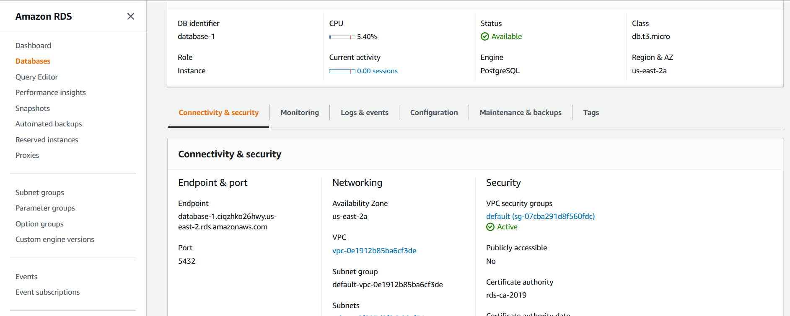
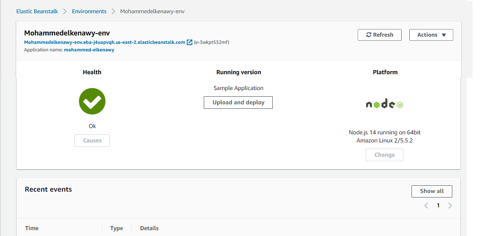
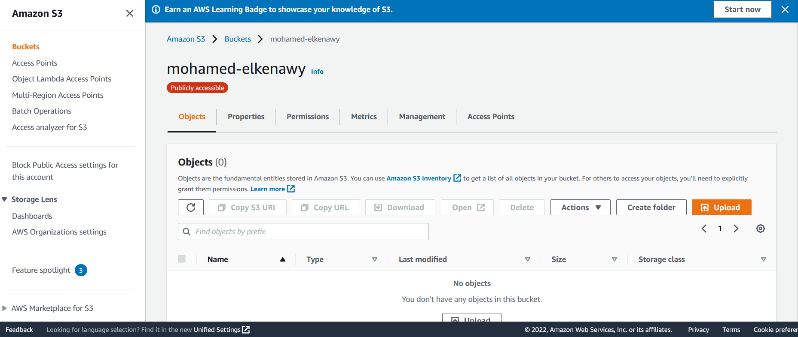

## Architecture Diagram

---

## Database: RDS DB

AWS RDS PostgreSQL Database info Sequelize:

- postgres://postgres:postgres@[database-1.ciqzhko26hwy.us-east-2.rds.amazonaws.com](database-1.ciqzhko26hwy.us-east-2.rds.amazonaws.com):5432/postgres

  

- connection status

  

---

## Elastic Beanstalk

EB URL: [http://mohammedelkenawy-env.eba-j4uapvqh.us-east-2.elasticbeanstalk.com/](http://mohammedelkenawy-env.eba-j4uapvqh.us-east-2.elasticbeanstalk.com/)

---

## S3 Bucket

S3 Bucket URL: [http://mohamed-elkenawy.s3-website.us-east-2.amazonaws.com/](http://mohamed-elkenawy.s3-website.us-east-2.amazonaws.com/)

